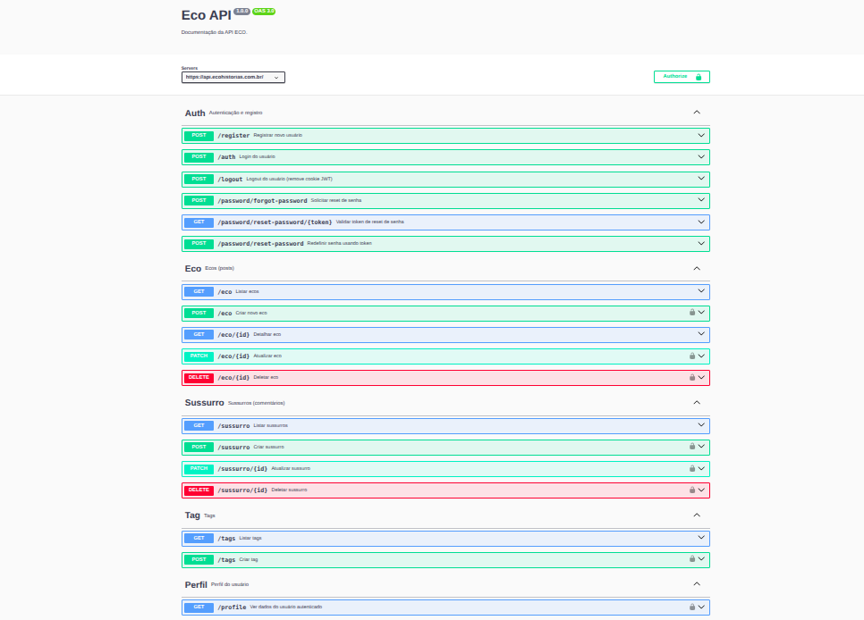
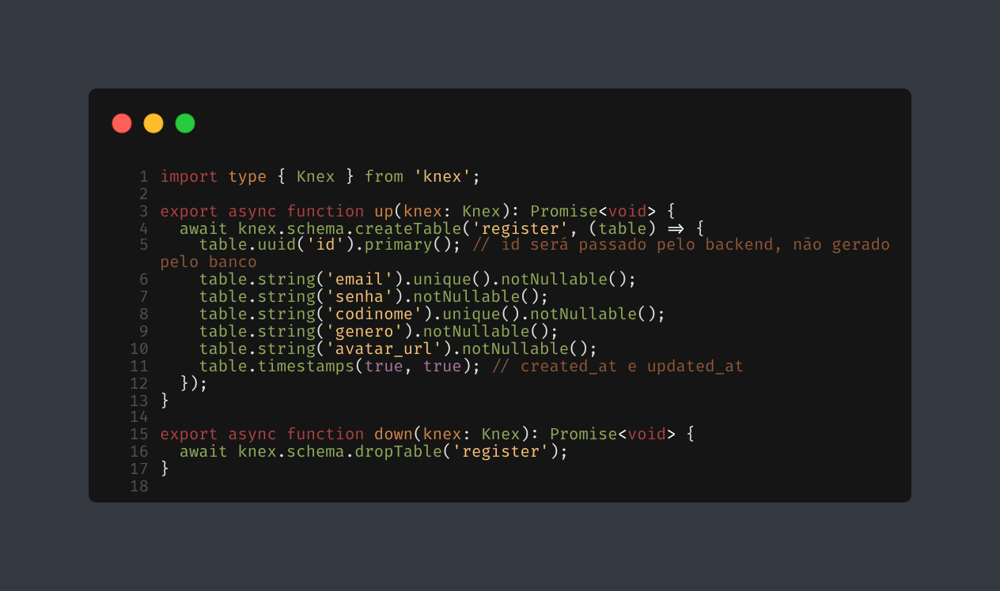

<h1 align="center">
Eco Stories
</h1>
<p align="center">
  
</p>
<div align="center">
  <!-- Line 1 -->
  
  
  
  <br>
  <!-- Line 2 -->
  
  
  <br>
  <!-- Line 3 -->
  
  
  <p align="center">
    <a href="https://www.labemunisul.com.br/swagger.html">
      
    </a>
    <a href="./EnglishREADME.md">
      
    </a>
  </p>
</div>

<h2>Project Purpose</h2> 
<p>
Eco aims to develop a minimalist mobile and web platform for anonymous story sharing, prioritizing privacy, emotional comfort, and simple navigation. Anonymity is guaranteed by nicknames and fixed avatars—no real names or customizable profiles—using email authentication only for basic moderation, with no external integrations. Each post (“Eco”) has limited comments and is categorized by sensitive tags, avoiding gamification and excessive exposure. The architecture uses React Native and React on the frontend (private repositories due to backend focus), while the API is built with Node.js, Express, and PostgreSQL, with avatar storage on AWS S3 and automated deployment via Docker. All development follows security, modularity, and privacy-respecting principles, with clear Swagger documentation, automated tests via Vitest, and Knex Query Builder for database operations. This is a backend-focused project; I will not detail the frontend development here.
</p>
<p>
  To learn more about the project philosophy, check out the article published on
  <a href="https://medium.com/@pedrojson/programei-uma-rede-social-do-zero-e-vou-te-mostrar-como-ela-funciona-689b8f558f33" target="_blank">Medium</a>.
</p>

<hr/>

<h2>Docs</h2>

<p>
  Access the documentation at:<br>
  <a href="https://api.ecohistorias.com.br/docs/" target="_blank">Swagger</a>
</p>
<p>
  <strong>Note:</strong> The routes for listing users and posting Ecos have been removed from the production branch! They were only used for debugging and tests. They are not documented in Swagger as they are not official, but they remain available in the development branch (<code>main</code>).
</p>

<h2>Authentication & Security</h2>
<p>
  <code>JWT</code> authentication uses <strong>httpOnly cookies</strong> to store the session token, increasing security against XSS attacks. The backend uses the <code>cookie-parser</code> middleware to read cookies in protected routes, while the frontend is adapted to avoid direct token handling, employing <code>credentials: 'include'</code> in all authenticated requests. Sensitive variables are managed via <code>dotenv</code> and passwords are always stored hashed with <code>bcrypt</code>. <code>CORS</code> is enabled for frontend/backend integration with strict origin control.
</p>
<p>
  Additionally, the API uses <code>helmet</code> to enhance HTTP security headers, <code>rate limiting</code> to limit requests and prevent abuse/brute force, and <code>zod</code> for robust input validation on all public and protected routes.
</p>


<h2>Database</h2>
<p>
  The project database is structured in <code>PostgreSQL</code> with relational modeling. Database access and query building are done using the <code>Knex Query Builder</code>, which facilitates maintenance, migrations, and standardization of SQL operations. During development, I used <code>pgAdmin</code> for local management, but in the production branch, I opted for <strong>Neon</strong> as a cloud PostgreSQL solution, ensuring high availability, automatic backups, and efficient backend integration.
</p>


<h2>Testing</h2>
<p>
  API automated tests are implemented with <code>Vitest</code>, providing efficient coverage of routes, services, and middlewares, with fast execution and integration into the development workflow. The entire backend is developed in <code>TypeScript</code>, ensuring static typing, better code organization, and reduced bugs during development and maintenance.
</p>

<h2>Docker</h2>
<p>
  The project uses <code>Docker Compose</code> to orchestrate all essential services, making it easy to set up and run the local environment with just one command. The PostgreSQL database, backend, migration and seed scripts, environment variables, and Swagger documentation are all pre-configured, speeding up setup for development and testing. The use of containers also simplifies continuous deployment on the Render platform.
</p>

<h2>Important: Cookies, CORS and Domains</h2>
<p>
  To ensure secure authentication via httpOnly cookies, the frontend and backend <strong>must be on the same root domain</strong> (e.g.: <code>ecohistorias.com.br</code> and <code>api.ecohistorias.com.br</code>). This is because browsers only send cookies automatically to the same domain or configured subdomains.<br>
  If the backend is hosted on a different domain (e.g.: <code>eco.onrender.com</code>), the authentication cookie <strong>will not be sent</strong> in frontend requests, even if the backend tries to set the cookie.<br>
  For this reason, in production, I use subdomains of the same main domain and configure the cookie as follows:
</p>

```js
domain: '.ecohistorias.com.br',
sameSite: 'lax',
secure: true
```
