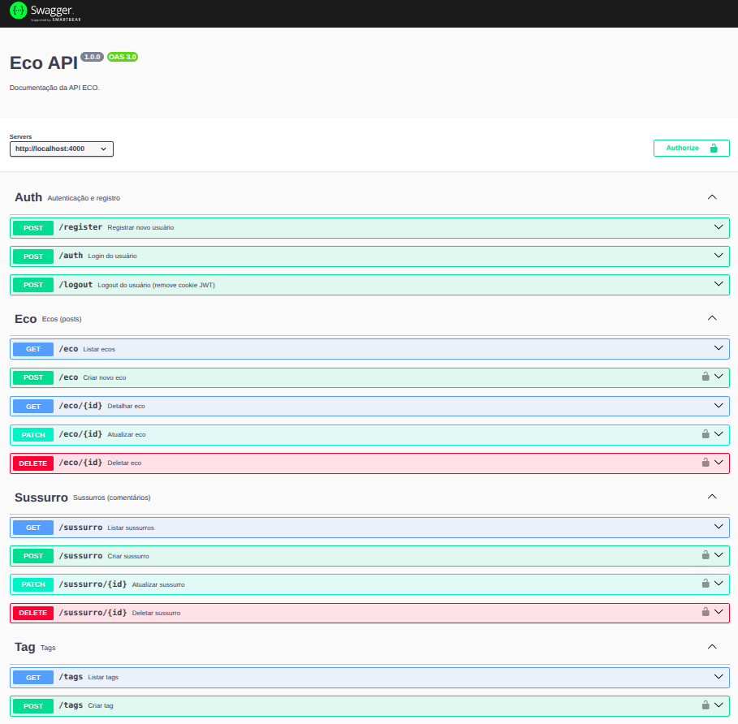
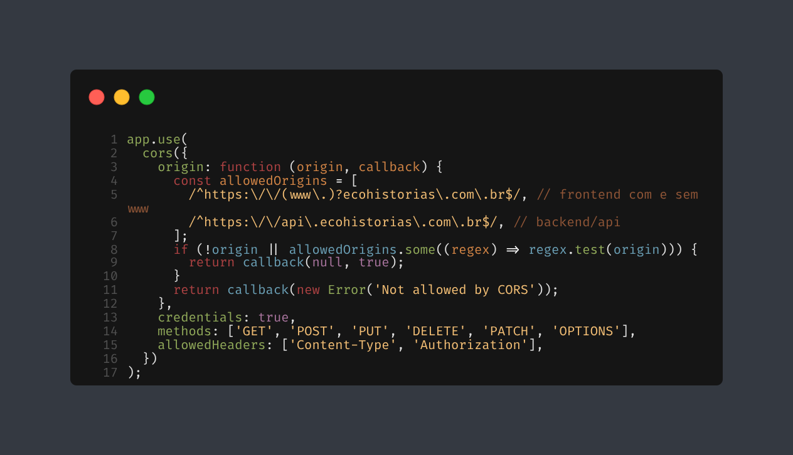
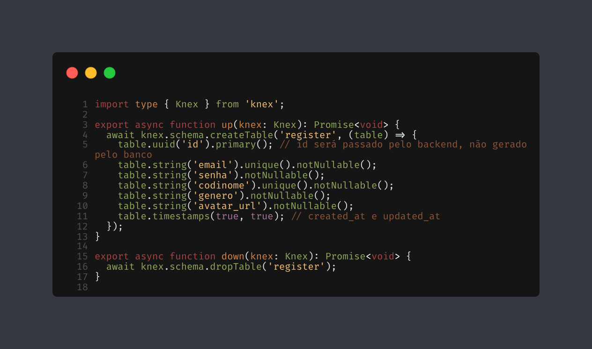

<h1 align="center">
Eco Histórias
</h1>

<p align="center"><em>Vozes sem Ego.</em></p>

<div align="center">
  <!-- Linha 1 -->
  
  
  

  <br>
  <!-- Linha 2 -->
  
  

  <br>
  <!-- Linha 3 -->
  
  


  <p align="center">
  <a href="https://api.ecohistorias.com.br/docs/">
    
  </a>
  <a href="./EnglishREADME.md">
    
  </a>
</p>
</div>
<p align="center">
  
</p>

<h2>Objetivo do Projeto</h2> 
<p> 
O Eco tem como objetivo desenvolver uma plataforma mobile e web minimalista para compartilhamento anônimo de histórias, priorizando privacidade, conforto emocional e navegação simples. O anonimato é garantido por codinomes e avatares fixos, sem nomes ou perfis personalizáveis, com autenticação via e-mail apenas para moderação básica, sem qualquer integração externa. Cada publicação (“Eco”) possui comentários limitados e é categorizada por tags sensíveis, evitando gamificação e exposição excessiva. A arquitetura utiliza React Native e React no frontend (repositórios privados devido ao foco em backend), enquanto a API é construída com Node.js, Express e PostgreSQL, com armazenamento de avatares em AWS S3 e deploy automatizado via Docker. Todo o desenvolvimento segue princípios de segurança, modularidade e respeito à privacidade, com documentação clara no Swagger, testes automatizados via Vitest e uso de Knex Query Builder. O projeto é backend focus e não citarei o desenvolvimento front-end ao decorrer. 
</p>
<p>
  Para conhecer a filosofia do projeto, confira o artigo publicado no 
  <a href="https://medium.com/@pedrojson/programei-uma-rede-social-do-zero-e-vou-te-mostrar-como-ela-funciona-689b8f558f33" target="_blank">Medium</a>.
</p>

<hr/>

<h2>Docs</h2>

<p>
  Acesse a documentação em:<br>
  <a href="https://api.ecohistorias.com.br/docs/" target="_blank">Swagger</a>
</p>
<p>
  <strong>Observação:</strong> As rotas para listar usuários e publicar Ecos foram removidas da branch de produção! Elas foram utilizadas apenas para debug e testes. Não estão documentadas no Swagger por não serem oficiais, mas ainda permanecem disponíveis na branch de desenvolvimento (<code>main</code>).
</p>

<h2>Autenticação e Segurança</h2> 
<p> A autenticação <code>JWT</code> utiliza <strong>cookies httpOnly</strong> para armazenar o token de sessão, aumentando a segurança contra ataques XSS. O backend faz uso do middleware <code>cookie-parser</code> para leitura dos cookies em rotas protegidas, enquanto o frontend foi adaptado para não manipular tokens diretamente, empregando <code>credentials: 'include'</code> em todas as requisições autenticadas. Variáveis sensíveis são gerenciadas via <code>dotenv</code> e as senhas são sempre armazenadas de forma hasheada com <code>bcrypt</code>. <code>CORS</code> é habilitado para integração frontend/backend com controle de origem.</p> 
<p> Adicionalmente, a API utiliza <code>helmet</code> para reforçar os headers de segurança HTTP, <code>rate limiting</code> para limitar requisições e evitar abusos/brute force, e <code>zod</code> para validação robusta dos dados de entrada em todas as rotas públicas e protegidas. </p>

<p>
  <strong>Recuperação de Senha:</strong> O backend implementa um fluxo seguro de "esqueci minha senha", onde o usuário recebe um e-mail com um link temporário para redefinir sua senha. O envio é feito via <code>Nodemailer</code> integrado ao <code>Mailjet</code>, garantindo entrega confiável e rápida. O token de reset é único, expira em 2 horas e só pode ser usado uma vez. Para evitar abusos, há limitação de tentativas por IP (rate limiting). O sistema também orienta o usuário a verificar a caixa de spam/lixeira.
</p>



<h2>Database</h2> 
<p> O banco de dados do projeto é estruturado em <code>PostgreSQL</code>, com modelagem relacional. O acesso ao banco e a construção de queries utilizam o <code>Knex Query Builder</code>, o que facilita a manutenção, migrações e padronização das operações SQL. Durante o desenvolvimento, utilizei o <code>pgAdmin</code> para gerenciamento local, mas, na branch de produção, optei pelo <strong>Neon</strong> como solução de PostgreSQL em nuvem, garantindo alta disponibilidade, backups automáticos e integração eficiente com o backend.</p>


<h2>Testes</h2> 
<p>Os testes automatizados da API são implementados com <code>Vitest</code>, proporcionando cobertura eficiente de rotas, serviços e middlewares, com execução rápida e integração ao fluxo de desenvolvimento. Todo o backend é desenvolvido em <code>TypeScript</code>, garantindo tipagem estática, melhor organização do código e redução de bugs durante o desenvolvimento e manutenção da aplicação.
</p>

<h2>Docker</h2>
<p> O projeto utiliza <code>Docker Compose</code> para orquestrar todos os serviços essenciais, facilitando a configuração e execução do ambiente local com apenas um comando. O banco de dados PostgreSQL, backend, scripts de migrations e seeds, variáveis de ambiente e documentação Swagger já vêm pré-configurados, agilizando o setup para desenvolvimento e testes. O uso de containers também simplifica o deploy contínuo na plataforma Render.</p>

<h2>Importante: Cookies, CORS e Domínios </h2>

<p>Para garantir autenticação segura via cookies httpOnly, o frontend e o backend **precisam estar no mesmo domínio raiz** (ex: `ecohistorias.com.br` e `api.ecohistorias.com.br`). Isso ocorre porque navegadores só enviam cookies automaticamente para o mesmo domínio ou subdomínios configurados.
Se o backend estiver hospedado em um domínio diferente (ex: `eco.onrender.com`), o cookie de autenticação **não será enviado** nas requisições do frontend, mesmo que o backend tente setar o cookie.  
Por isso, em produção, utilizo subdomínios do mesmo domínio principal e configurei o cookie com:</p>

```js
domain: '.ecohistorias.com.br',
sameSite: 'lax',
secure: true
```

<p>No frontend, (<code>Axios</code>) usei `credentials: 'include'` nas requisições autenticadas.

> - Frontend: `https://ecohistorias.com.br`
> - Backend: `https://api.ecohistorias.com.br`
> - Cookie: `domain: '.ecohistorias.com.br'`
> - Ambos em HTTPS

Assim, a autenticação via cookie funcionará perfeitamente e de forma segura!

</p>

<h2> Como rodar a branch de desenvolvimento (MAIN) localmente com Docker Compose</h2>
<p>
  <strong>Pré-requisitos:</strong><br>
  - Docker Compose instalado<br>
  - git clone https://github.com/mmyersbyte/eco

</p>
<p>
  <strong>Passo único:</strong><br>
  <code>docker compose up --build</code>
</p>
<p>
  <strong>Acessar aplicação:</strong><br>
  API: <a href="http://localhost:4000" target="_blank">http://localhost:4000</a><br>
  Swagger: <a href="http://localhost:4000/docs" target="_blank">http://localhost:4000/docs</a>
</p>

## Estrutura de Pastas e Arquivos

```
eco/

├── src/
│   ├── @types/
│   │   ├── eco.d.ts
│   │   ├── express.d.ts
│   │   ├── register.d.ts
│   │   └── sussurro.d.ts
│   ├── config/
│   │   └── auth.ts
│   ├── controllers/
│   │   ├── controller-auth.ts
│   │   ├── controller-eco.ts
│   │   ├── controller-register.ts
│   │   ├── controller-sussurro.ts
│   │   └── controller-tag.ts
│   ├── database/
│   │   ├── migrations/
│   │   │   ├── 20250621210820_create-register.ts
│   │   │   ├── 20250622001326_create-eco.ts
│   │   │   ├── 20250622001613_create-sussuro.ts
│   │   │   ├── 20250623093355_create-tags.ts
│   │   │   └── 20250623093554_create-eco_tags.ts
│   │   ├── seeds/
│   │   │   ├── 001_tags.ts
│   │   │   ├── 002_users.ts
│   │   │   └── 003_ecos.ts
│   │   └── knex.ts
│   ├── middlewares/
│   │   ├── ensureAuthenticated.ts
│   │   ├── errorHandling.ts
│   │   ├── notFoundHandler.ts
│   │   ├── rateLimiter.ts
│   │   └── verifyUserAuthorization.ts
│   ├── notas/
│   │   └── JWT_IMPLEMENTACAO.md
│   ├── routes/
│   │   ├── auth-routes.ts
│   │   ├── eco-routes.ts
│   │   ├── health-routes.ts
│   │   ├── index.ts
│   │   ├── logout-routes.ts
│   │   ├── profile-routes.ts
│   │   ├── register-routes.ts
│   │   ├── sussurro-eco.ts
│   │   ├── swagger-routes.ts
│   │   └── tag-routes.ts
│   ├── utils/
│   │   └── AppError.ts
│   └── app.ts
├── tests/
│   ├── auth.test.ts
│   ├── cookie.test.ts
│   └── register.test.ts
├── .dockerignore
├── .env
├── .env.example
├── .gitignore
├── docker-compose.yml
├── Dockerfile
├── knexfile.ts
├── package.json
├── package-lock.json
├── README.md
├── server.ts
├── swagger.json
├── tsconfig.json
└── vitest.config.ts
```
